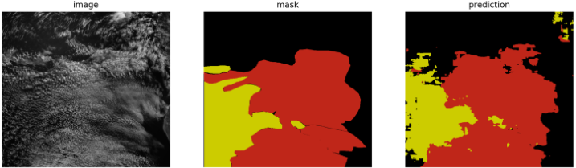

# clouds_segmentation
segmentation of satellite images of clouds into three types Open MCC, Closed MC and others.

### Training and Evaluation
In order to train and evaluate, simply run python main.py, you can change or tune the configuration in the macros.py file before.
At the first run, you will need to updates the paths of the data directories, the directories structure of the data should be as following: \
main_data_dir- \
&nbsp;&nbsp;-Train\
        &nbsp;&nbsp;&nbsp;&nbsp;-Images \
        &nbsp;&nbsp;&nbsp;&nbsp;-Masks \
    &nbsp;&nbsp;-Test \
        &nbsp;&nbsp;&nbsp;&nbsp;-Images \
        &nbsp;&nbsp;&nbsp;&nbsp;-Masks \
    &nbsp;&nbsp;-Valid     \
        &nbsp;&nbsp;&nbsp;&nbsp;-Images \
        &nbsp;&nbsp;&nbsp;&nbsp;-Masks 
       
      
The final results of confusion matrixes per set, weights, and log of test\train curves of loss and accuracy will be in the output directory that its name is just a timestemp.        

### Create Patches
In order to split the data from full images to many small paches, you can use the patches_maker.py file by simply edit its arguemnts (of paths and sizes) at the head of the file and run it.

### Make CM with given weigths
You can run the cm_calculator.py in order to calculate the confusion matrix for a given weights. It enables to test weights of specific configuration also with a diffrent test configuration because here the weights are given as an independent input (could be usefull fir example to train on four classes and to test on three classes). You only need to adjust the configuration in macros file and to change the paths at the cm_calculator.py
